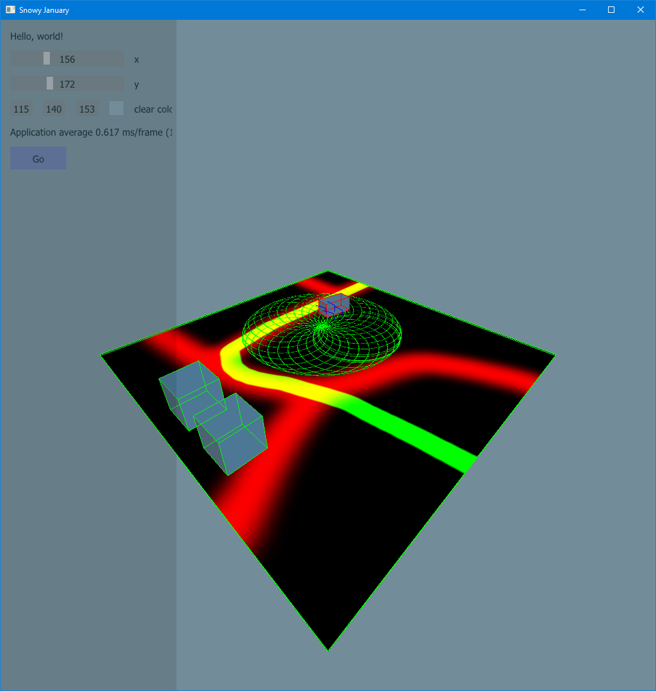

# Progress

## January 31

Added loading the truck with seperate wheels from obj file.

## January 27

Controlling the car is now done by the keyboard, with mapped keys saved and loaded from/to disk.

Got the mask painting from car position working, makes some good art:P

## January 23

Added car code for the physics. Also added the debug drawer for bullet to make the shapes really visible.

## January 21

Masking is done now. There are three textures needed. First a texture for grass, second a texture for road, third a textures for snow and fourth a mask texture. The first two textures are merged based on the R values of the mask. The result of this merge will be merged with the snow textures based on the G values of the mask. This will be the end result. The first three textures have a fixed size and are repeated over the plane. The mask textures is fully fit over the triangles of the plane.

## January 20

Finally got to the shader with textures. Next step is the masking to merge multiple textures.

## January 9

Improved my simple BufferType class with methods to generte cube and plane vertices. Further mre there are methods to scale and move the vertices. And last the ImGui styles are altered.

## January 8

The skeleton for the game is ready. This contains a [SDL2](https://www.libsdl.org/download-2.0.php) window with OpenGL headers from [Glad](https://github.com/Dav1dde/glad). For the GUI I used [Dear ImGui](https://github.com/ocornut/imgui). It also contains physics by [Bulletphysics](https://pybullet.org/wordpress/).
