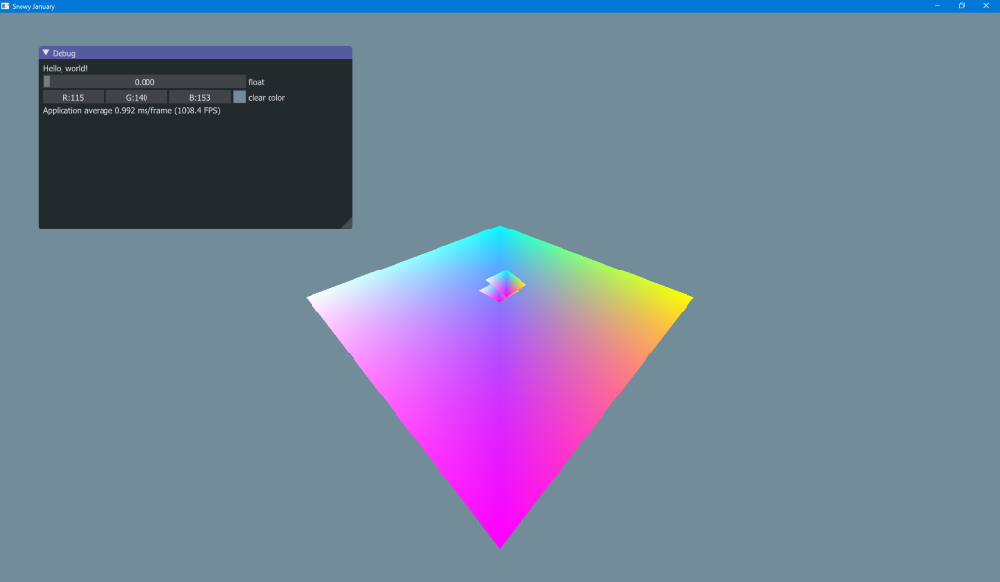

# Progress

## January 8

The skeleton for the game is ready. This contains a [SDL2](https://www.libsdl.org/download-2.0.php) window with OpenGL headers from [Glad](https://github.com/Dav1dde/glad). For the GUI I used [Dear ImGui](https://github.com/ocornut/imgui). It also contains physics by [Bulletphysics](https://pybullet.org/wordpress/).
